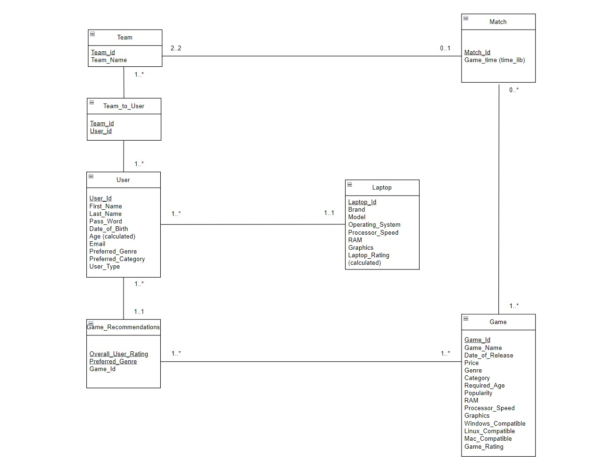

<div align="center">
<h1>Innovative E-sports Tournament Management System 🎮</h1>

[]()


*A comprehensive platform for e-sports tournament management and game recommendations*
</div>

# 📑 Table of Contents
- [Project Overview](#-project-overview)
- [Key Features](#-key-features)
- [System Architecture](#-system-architecture)
- [Technical Implementation](#-technical-implementation)

# 🎯 Project Overview

The Innovative E-sports Tournament Management System is a comprehensive online platform designed to revolutionize the organization and participation experience in e-sports tournaments. Our system combines tournament management capabilities with intelligent game recommendations, creating a unique ecosystem for gamers and organizers.

## Core Components

### 1. Tournament Registration System
- Seamless registration process for e-sports tournaments
- Comprehensive tournament information management
- Support for multiple game titles and genres
- Advanced tournament organization tools
- Match scheduling and management

### 2. Game Recommendation Engine
- Powered by steamDB.info dataset
- Personalized game suggestions based on user preferences
- Intelligent matching algorithm
- Platform compatibility analysis
- Performance requirement verification

# 🌟 Key Features

1. **User-Centric Design**
   - Individual and Organizer profiles
   - Personalized gaming preferences
   - Hardware compatibility checking
   - Team management capabilities

2. **Tournament Management**
   - Automated match scheduling
   - Team registration system
   - Real-time updates
   - Multi-game support

3. **Smart Recommendations**
   - Genre-based game suggestions
   - Hardware compatibility verification
   - Age-appropriate recommendations
   - Popularity metrics integration

# 🏗 System Architecture

## Database Design

### UML Diagram


### Core Entities

1. **User Entity**
   - Unique user identification
   - Profile management
   - Hardware specifications
   - Gaming preferences

2. **Team Entity**
   - Team management
   - Member associations
   - Tournament participation tracking

3. **Game Entity**
   - Comprehensive game information
   - System requirements
   - Compatibility metrics
   - Popularity tracking

4. **Match Entity**
   - Tournament scheduling
   - Team pairing
   - Result tracking

5. **Laptop Entity**
   - Hardware specifications
   - Performance metrics
   - Compatibility checking

# 💾 Technical Implementation

## Database Schema

### Entity Relationships
- **User-Team**: Many-to-Many relationship
- **Team-Match**: One-to-Many relationship
- **Game-Match**: One-to-Many relationship
- **User-Laptop**: One-to-Many relationship

### Normalization
- Implemented 3NF (Third Normal Form)
- Optimized for data integrity
- Reduced redundancy
- Efficient query performance

## Relational Schema Details

### Core Tables
```sql
User(
    User_id VARCHAR(PK), 
    First_Name VARCHAR, 
    Last_Name VARCHAR, 
    Password VARCHAR,
    Date_of_Birth DATE, 
    Age INT, 
    Email VARCHAR, 
    Preferred_Genre VARCHAR,
    User_Type ENUM ('Individual','Organizer')
)

Game(
    Game_id VARCHAR(PK),
    Game_Name VARCHAR,
    Date_of_Release DATE, 
    Genre VARCHAR,
    Required_Age VARCHAR, 
    Popularity INT,
    Game_Rating DECIMAL(3, 2)
)

Team(
    Team_id VARCHAR(PK), 
    Team_Name VARCHAR,
    User_id VARCHAR [FK to User.User_id]
)
```

# 🔄 Workflow

1. **User Registration**
   - Profile creation
   - Hardware specification input
   - Preference selection

2. **Tournament Management**
   - Creation by organizers
   - Team registration
   - Match scheduling
   - Result tracking

3. **Game Recommendations**
   - User preference analysis
   - Hardware compatibility check
   - Personalized suggestions

# 🚀 Future Enhancements

1. **Enhanced Analytics**
   - Player performance tracking
   - Tournament statistics
   - Team rankings

2. **Advanced Matchmaking**
   - Skill-based pairing
   - Regional matchmaking
   - Custom tournament formats

3. **Integration Features**
   - Stream integration
   - Social media connectivity
   - Real-time notifications

# 📋 Requirements

- Modern web browser
- Stable internet connection
- Compatible gaming hardware
- Valid email for registration

# 🤝 Contributing

We welcome contributions to enhance the platform. Please see our contributing guidelines for more information.

---

<div align="center">
Made with ❤️ for the Gaming Community
</div>
