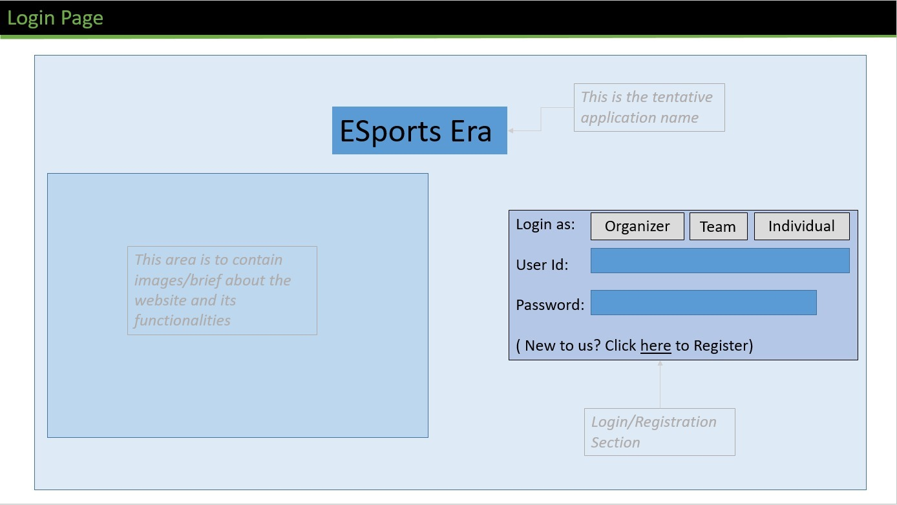

# **PROJECT PROPOSAL REPORT**

## **1. Title and Project Summary**

### **Project Title:** 
#### Innovative E-sports Tournament Management System

### **Project Summary:**

The Innovative E-sports Tournament Management System is a comprehensive online platform designed to revolutionize the organization and participation experience in e-sports tournaments. Our project is a multifaceted web application that bridges the gap between gamers' interests and e-sports tournaments. It consists of two primary components: a tournament registration system, and a game recommendation engine.

**Part 1: Tournament Registration System**

The first component empowers users to seamlessly register for e-sports tournaments related to their favorite games. Whether they're casual gamers or competitive e-sports enthusiasts, users can access a wide array of tournaments catering to different game titles and genres. The system will provide detailed tournament information, including dates, formats, and entry requirements. Participants can conveniently register for tournaments that align with their gaming interests and skill levels. Furthermore, our platform will facilitate tournament management for organizers, streamlining the process from tournament creation to match scheduling.

**Part 2: Game Recommendation Engine**

The second component of our project is a game recommendation engine that leverages the rich dataset - ‘steamDB.info’ to suggest games to users based on their preferences and the criteria associated with each game. Users will provide input on their gaming interests, such as preferred genres, gameplay styles, and platform preferences. The recommendation engine will then analyze the dataset to offer personalized game suggestions that align with the user's gaming profile. By harnessing the comprehensive data from SteamDB.info, our system will ensure that users discover games that truly resonate with their gaming preferences.

E-Sports Era aspires to be the go-to destination for gamers seeking personalized game recommendations and effortless tournament registration. By combining the power of data-driven game suggestions and a user-friendly e-sports tournament system, our project aims to enhance the gaming experience, connect gaming communities, and foster competitive gaming excellence.

#### **Similar Applications**

As mentioned above, the overall aim of the project is to enable the access to the world of e-sports by providing a shop stop to alllevels of gamers and tournament organizers. Based on our research, sites that provide an integration between the two are quite rare, however, site providing the same individually can be seen below:

1. Game Recommendation Engine:
Steam's recommendation system, GOG's game suggestions, and various other are some similar platforms which offer game recommendations. Our system on the other hand leverages a rich dataset, potentially offering more comprehensive recommendations compared to individual platforms. Also, by considering various factors like genres, gameplay styles, and platform preferences, our recommendation engine provides more nuanced and tailored suggestions.

2. Tournament Registration System:
Battlefy, Toornament, and Challonge are some comparable platforms for E-sports tournament management and registration. Meanwhile, our platform focuses on a wide array of games and genres, catering to a broader audience compared to platforms like Challonge, which primarily focuses on user-generated tournaments. The emphasis on tournament management for organizers sets our system apart, making it a valuable tool for event organizers in the esports community.

## **2. Detailed Description of Application**

**2.1 Introduction**

The world of e-sports is experiencing rapid growth, and our project aims to leverage technology to enhance the e-sports tournament management experience. We propose to create a web-application that simplifies the process of organizing and participating in e-sports tournaments. This platform will cater to both tournament organizers and participants, offering a range of features to improve engagement and competitiveness.

E-Sports Era aims to address the growing demand for an all-encompassing platform for e-sports tournament management. The application seeks to simplify tournament organization, enhance the e-sports experience for participants and spectators, and foster a vibrant e-sports community.

**2.2 Basic Functions of the Web Application**

The proposed web application, titled "E-Sports Era," is designed to serve as a comprehensive platform for e-sports tournament management. Users of E-Sports Era will have access to a wide range of functionalities, including:

\- *Tournament Creation*: Tournament organizers can create and customize e-sports tournaments. They can specify game titles, formats, dates, entry fees, and prize pools.

\- *Participant Registration*: Gamers can browse and find tournaments of interest, register for them, and pay entry fees if applicable.

\- *Match Scheduling*: Organizers can schedule match times, display them to participants, and send notifications. Participants can view their upcoming matches.

\- *Gaming Recommendations*: Aspiring gamers would be able to leverage the platform by receiving recommendations for games based on their current laptop device.

**2.3 CRUD of the Web Application**

The application consists of numerours CRUD applications that the user would be able to perform. 

Initially, the Create opertaion will be performed by the user when they create their own user account and input their laptop detailsto the same; basedon user profile, if user is an organizer, they would be able to create tournaments as well.

The user, based on requirement would be able to modify their laptop specifications, while also being able to add and delete laptops associated to their profile. In turn, an organizer can also cancel (delete) a particular tournament,or even modify (update) the requirements of the tournament (like, format, number of teams, game to be played)  
 

## **3. Detailed Usefulness Description of Application**

E-Sports Era offers a unique blend of features that differentiates it from existing e-sports tournament platforms. While similar websites and applications exist, our platform stands out with gamification elements. These innovations create a more engaging and immersive e-sports experience. E-Sports Era aims to be a one-stop destination for e-sports enthusiasts and organizers, offering convenience, community-building, and competitive excellence.

A summary of benefits to the platform can be seen below:

\- *Simplified Tournament Creation*: Organizers can effortlessly create and manage tournaments, specifying formats, schedules, and entry fees.

\- *Enhanced Engagement*: Gamification features will encourage more participants, leading to larger tournaments and greater visibility.

\- *Community Building*: The platform fosters a sense of community, driving brand loyalty and attracting sponsors.

## **4. Detailed Realness Description of Your Application**

The primary source of data for E-Sports Era is the steamDB.info dataset provided by the TA’s. This dataset contains a comprehensive collection of information about various video games available on the Steam platform. It includes attributes such as game titles, genres, user reviews, developer and publisher information, pricing details, and system requirements. This dataset serves as the foundation for offering a diverse selection of e-sports tournaments based on specific game titles and genres. The platform will adhere to industry regulations and ethical guidelines regarding fair competition and responsible gaming.

Apart from this, for training purposes, random test data is to be generated and used for the purpose of testing the Scheduling capabilities of the application.

## **5. Creativity Description of Your Application**
The below mentionedprovide a description of the creative component of our proposed application:

1. Integrated Tournament Registration System: Seamlessly combines a game recommendation engine with a tournament registration system, providing users with a unified platform for discovering and participating in esports events related to their favorite games.

2. Personalized Game Recommendations for Laptop Configuration: Offers game suggestions tailored to users' laptop configuration specifications, ensuring that gamers can discover and enjoy titles that run smoothly on their hardware

## **6. Detailed Functionality Description of Your Application**

E-Sports Era offers a rich experience for both organizers and participants. Organizers can create and manage tournaments, schedule matches, and have a comprehensive overview of the entire tournament proceedings. The process begins with an organizer creating an account using the 'Organizer Role,' granting them access to create tournaments and view data of participating teams or individuals (based on the type of tournament). Once the organizer's set number of tournament slots is filled, the application will automatically generate a schedule, ensuring a seamless experience for users.

Individual users can leverage the platform by registering and specifying their devices and preferred game types. Based on this information, the application would recommend games that match their interests and device capabilities, taking into account the nature of the games. Additionally, when applying for team-based tournaments, team leaders or managers would be required to register the team. Each team would be required to have an 'Individual-user account,' which will be added to their team account for that specific tournament. While registering as a team, the information required would be the team name, the tournament they are registering for and the user id of each of the team members (it is to be noted that each team member is to have a individual account on theplatform before being able to register in a team).

These three account types describe the various roles created in the database, providing different users with access to varying content and displaying a unique homepage for each user. (A brief UI representation will be presented in the section below.)

In conclusion, the Innovative E-Sports Tournament Management System aims to provide a unique and invaluable experience for e-sports enthusiasts and tournament organizers. With innovative features, real-world applicability, and a strong focus on user engagement and security, this project has the potential to reshape the e-sports landscape.

## **7. UI-Mockup**

> Login Page

> Registration Page:

> Individual User Page:

> Organizer Page:

## **8. Work Distribution:**

The objective of our team is to ensure that every member gets the opportunity to work in every aspect of the project. However, the below overview represents team members who will be taking leads on particular aspects of the project.

**Project Management:** Amaan

**Database Creation**: Imaad, Amaan

**Test Data Generation**: Harshit, Amaan, Imaad, Prajeet

**Frontend Development**: Prajeet, Harshit

**Connecting Database & Frontend**: Prajeet, Imaad

**Backend Development**: Imaad, Amaan, Harshit, Prajeet
