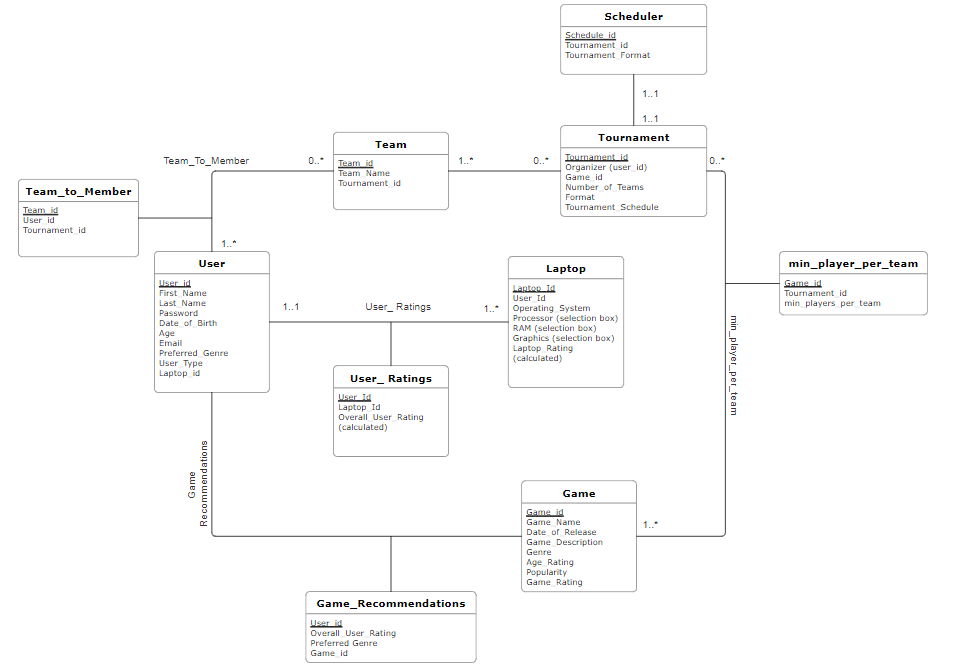

# Database conceptual design

## UML Diagram



## Entities

There are a total of five entities for our database design. Each is explained in detail as follows.

### 1. User 

This is an entity regarding general user information as well as user authentication information, with the below mentioned attributes.

1.	User_id: a unique identifier to distinguish between users. This should be a varchar attribute and primary key for this table. User_id will serve as the username for login page.
2.	First_Name: stores the first name of a user. This should be a varchar attribute.
3.	Last_Name: stores the last name of a user. This should be a varchar attribute.
4.	Password:  a string attribute, password for login the platform.
5.	Date_of_Birth: stores the DoB of User, and is a date format attribute
6.	Age: is a calculated field, calculated from Date_of_Birth field
7.	Email: stores email of user; is a varchar field
8.	Preferred_Genre: stores the preferred genre for gaming from the users; is a varchar field
9.	User_Type: an enumerate attribute with values `Individual` or `Organizer`. This is to identify whether the user is an `Individual` or an `Organizer`.
10.	Preferred_Category: stores the preferred category for gaming from the users; is a varchar field


This entity is designed according to the assumptions:

1. Every user in this platform will have a unique User_id and cannot be modified, regardless of their identity (Individual or Organizer).
2. Users can change their password, which is the only allowed update operation for this entity table. 
3. Once the user entered the User_id and Password, the system will automatically identify the type of the user (Individual or Organizer), and lead the user to the corresponding menu. We suppose that one person can only be either an Individual or an Organizer.
4. A user is to have one laptop associated to it. A user however can update the laptop configurations and can also add /delete laptops to his/her account.  
5. A user can have 0 or more teams associated to it.


### 2. Laptop

This is an entity for information of Laptops of the User, with the below mentioned attributes:

1.	Laptop_id: a unique identifier to distinguish laptops, will be a varchar attribute and primary key for this table.
2.	Brand: Name of Laptop Company
3.	Model: Name of the Laptop as per Comapny
4.	Operating_System: a varchar attribute to identify OS of the Laptop.
5.	Processor_Speed: an int attribute to identify processor of the Laptop.
6.	RAM: an int attribute to identify RAM of the Laptop
7.	Graphics: an int attribute to identify Graphics Card of the Laptop
8.	Laptop_Rating: a calculated decimal attribute to give the laptop a rating (to be used for gaming recommendations)


Here we make the following assumptions:


1.	A laptop can be associated to many users.
2.	Laptop_id is a field that is auto generated and not visible to the user, and is not editable.
3.	User_id is to be associated with Laptop_id automatically while a user sets up account.
4.	The remaining fields are to be user inputs based on selection boxes.
5.	Laptop rating is to be calculated from user inputs from selection box fields and is to be a decimal.

### 3. Team

The entity is for Team information and have the following attributes:
1.	Team_id: a unique identifier to distinguish teams, will be an int attribute and primary key for this table
2.	Team_Name: a varchar attribute to store team name
  

This entity is designed according to the assumptions:
1.	Every Team in this platform will have a unique Team_id and cannot be modified.
2.	Each team should have at least one member
  
### 4. Game

This is an entity for information of Games to be stored in the database, with the below mentioned attributes:
1.	Game_id: a unique identifier to distinguish games, will be an int attribute and primary key for this table.
2.	Game_Name: a string attribute to display the Game's name.
3.	Date_of_Release: a date attribute to denote when the game was released
4.	Price: a decimal attribute to give a price of game
5.	Required_Age: a varchar attribute to denote the age range the game is appropriate for
6.	Popularity: an real attribute to denote the popularity of the game (like a rating)
7.	Game_Rating: a calculated decimal attribute to give the game a rating (to be used for gaming recommendations)
8.	Processor_Speed: an int attribute to identify minimum required Processor Speed for the game 
9.	RAM: an int attribute to identify minimum required RAM for the game 
10.	Graphics: an int attribute to identify required GPU for the game
11.	Windows_Compatible: an int attribute to identify whether game is compatible with Windows
12.	Mac_Compatible: an int attribute to identify whether game is compatible with Windows
13.	Linux_Compatible: an int attribute to identify whether game is compatible with Windows

This entity is designed according to the assumptions:
1. Every game in this platform will have a unique Game_id and cannot be modified.
2. Game rating is to be calculated from steam dataset based on game hardware requirements to be run and is to be a decimal.
3. A game can have at least zero matches associated to it. (the thought process here is that it is not necessary that all games can have a match, example, a story based game)


### 5. Match

The entity is for Match information and have the following attributes:

1. Match_id: a unique identifier to distinguish matches, will be an varchar attribute and primary key for this table. 
2. Game_time: time attribute to store and capture match timings

This entity is designed according to the assumptions:
1.	Every match in this platform will have a unique Match_id and cannot be modified.
2.	Only users with “Organizer” profile can create a match.
3.	A match can only be between two teams


## Relations

There are a total of 2 relations in our database design, which will addressed in details as follows:


### 1. Game_Recommendations (User and Game)
This is a relation between `User` and `Game` that represents the games that are being recommended to the user.
It is to be noted here that one user can have many games recommended.
The games recommended will follow criteria like age restriction, genre preference and laptop capabilities. 
The attributes included in this relation are:
1.	Overall_User_Rating: denote the overall rating associated to user 
2.	Preferred_Genre: stores the preferred genre for gaming from the users; is a varchar field
3.	Tournament_id: acts as foreign key to Tournament table to identify Tournament associated with record


### 2. Team_to_Member (User and Team)
This is a relation between `User` and `Team`.
This is a relation to identify the various team members of the various teams. This is a **many-to-many** relation based on the following assumption that a user can be a part of many teams and that teams can have many members associated to it. 
The attributes included in this relation are:
1.	Team_id: acts as foreign key to User table to identify User associated with record, will be one of the primary keys for the relation
2.	User_id: acts as foreign key to User table to identify User associated with record.


## Table Transformations and Normalizations

**Match FD:**

Match_Id -> Game_time, Team_1_id, Team_2_id, Time

Explanation: This functional dependency indicates that for a given Match_Id, there is a unique association with Game_time, Team_1_id, and Team_2_id, and Time. We are making an assumption that each match will only have two teams. The time will be stored in Epoch format.

**Team FD:**

Team_id -> Team_Name

Explanation: This functional dependency specifies that for each unique Team_id, there is a single corresponding Team_Name. The players are not stored here because there can be an arbitrary number of players per team.

**Team to User FD:**

Team_id, User_Id -> Team_Name Explanation

Explanation: Created a separate table to associate Team to User because of the the many-to-many relationship 

**User FD:**

User_ID -> First_Name, Last_Name, Date_of_Birth, Email, Preferred_Genre, User_Type

Explanation: This functional dependency establishes that each User_ID corresponds to a unique set of attributes, including First_Name, Last_Name, Date_of_Birth, Email, Preferred_Genre, and User_Type. Personal Information will be used to calculate a game recommendation.

**User_to_Laptop FD:**

User_Id, Laptop_Id

Explanation: Many-to-many relationship between Users and Laptops meant we had to create a separate table.

**Laptop FD:**

Laptop_id -> Operating System, Processor, RAM, Graphics

Explanation: This data holds all the different configurations of a Laptop. The user picks from the available choices of Laptops to represent their laptop. This data is updated independently of what laptop users have.

**Game FD:**

Game_id -> Game_Name, Date_of_Release, Game_Description, Genre, Age_Rating, Popularity, Game_Rating

Explanation: This holds video games a Team can play along with meta-data to help assist in creating a recommendation for the User.


**Game Recommendations FD:**


Overall_User_Rating, Preferred Genre -> Game_id

Explanation: This functional dependency shows that the combination of Overall_User_Rating and Preferred Genre determines a specific Game_id. This is particularly useful for generating game recommendations based on user ratings and preferences, as it allows for efficient retrieval of recommended games that match a user's criteria.


**3NF Form**

The following table is in 3NF form. The team ensured that the table was in 2NF, and from there experimented the design until no transitive dependencies remained. 

The below mentioned points denote the normalization methods followed between our rendition of our initial to final UML diagram: 

1. “Number of Teams” in the Scheduler Table was redundantly storing information that other tables were also storing (“game_format” and “number_of_teams”)

2. The Tournament table was refactored to remove the “Min_Players_Per_Team”. This was redundantly storing this variable in both the Game and Tournament format, which doesn’t comply with 2nd Normal Form. To remedy this, a new table was created with a composite key of “Game_id” and “Tournament_id”

3. Previously, Team related data was not stored in any table, and limited information was stored in the Tournament table. Though, this was a problem because it led to transitive dependencies which don't comply with 3rd Normal Form. To remedy this, a new table was created just for Team related data. This also removed a 2nd Normal Form violation because previously we had 1 column for each new team (duplication of column is not allowed).

4. The initial approach was to store team members in the Team Table. Though, this meant each new team member will have a new column with their id stored. This was a duplication of column storage (storing the same attribute in multiple columns). Instead of creating a new table that computes the team to team members, we decided to store the “team_id” in each User’s table.

5. The Game Description Table contains the main logic of our project. In the initial sketch, we had “Game_Description” and “Game_Rating” in this table along with in the Game Table. This was a problem not only because it was stored twice, but when looking for the right game for a person, we would have to perform multiple joins, which is computationally expensive. To get around this, we instead use the “user_rating” variable which takes into account the game data and greatly simplifies the design. 

## Relational Schema
The database design will be converted into 10 tables.

**1. User**

```
User(
User_id VARCHAR(PK), 
First_Name VARCHAR(X), 
Last_Name VARCHAR(X), 
Password VARCHAR(X),
Date_of_Birth DATE, 
Age INT, 
Email VARCHAR(X), 
Preferred_Genre VARCHAR(X),
Preferred_Category VARCHAR(X), 
User_Type ENUM (‘Individual’,’Organizer’), 
Laptop_id VARCHAR [FK to Laptop.Laptop_id]
)
```

**2. Laptop**
```
Laptop(
Laptop_Id VARCHAR(PK),
Brand VARCHAR(X),
Model VARCHAR(X),
Operating_System VARCHAR(X),
Processor_SPEED INT(X),
RAM INT(X),
Graphics INT(X),
Laptop_Rating DECIMAL(3, 2)
)
```
**3. Team** 
```
Team(
Team_id VARCHAR(PK), 
Team_Name VARCHAR(X),
User_id VARCHAR [FK to User.User_id],
Match_Id VARCHAR [FK to Match.Match_id]
)
```
**4. Game**
```
Game(
Game_id VARCHAR(PK),
Game_Name VARCHAR(X),
Date_of_Release DATE, 
Genre VARCHAR(X),
Category VARCHAR(X),
Required_Age VARCHAR(X), 
Popularity INT,
Processor_Speed INT,
RAM INT,
Graphis INT,
Windows_Compatible INT,
Mac_Compatible INT,
Linux_Compatible INT,
Game_Rating DECIMAL(3, 2)
)
```


**5. Match**
```
Tournament (
Match_id INT(PK), 
Game_Time VARCHAR(X),
Game_Id VARCHAR [FK to Game.Game_id]
Team_Id VARCHAR [FK to Team.Team_id]
)
```

**6. Game_Recommendations**
```
Game_Recommendations (
User_id VARCHAR[FK to User.User_id],
Overall_User_Rating DECIMAL(3, 2),
Preferred_Genre VARCHAR(X), 
Game_id VARCHAR[FK to Game.Game_id]
)
```
**7. Team_to_Member**
```
Team_to_Member (
Team_id VARCHAR[FK to Team.Team_id], 
User_id VARCHAR[FK to User.User_id], 
)
```


