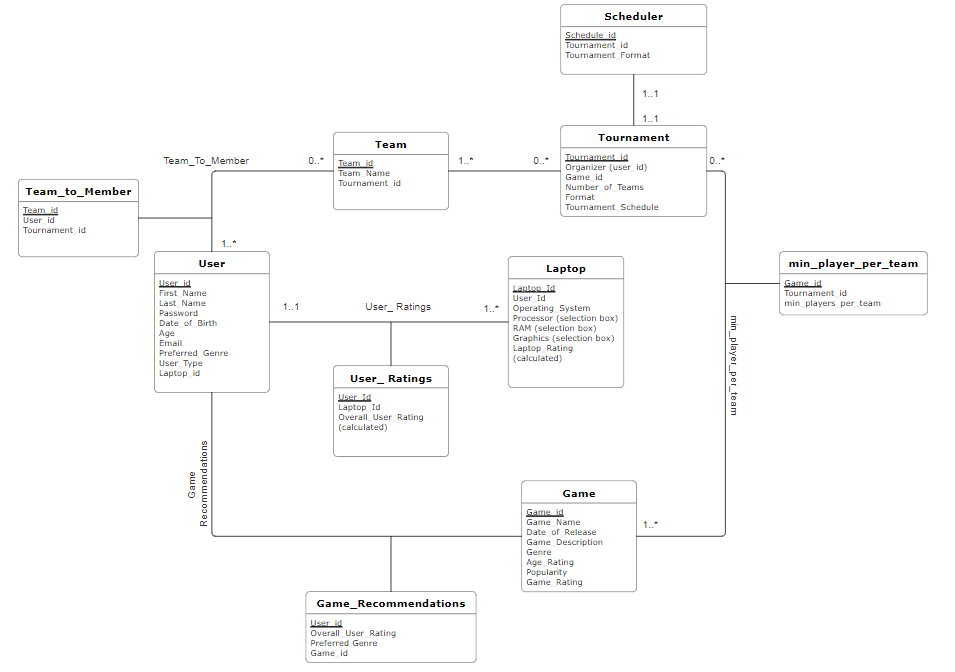

# Database conceptual design

## UML Diagram



## Entities

There are a total of six entities for our database design. Each is explained in detail as follows.

### 1. User 

This is an entity regarding general user information as well as user authentication information, with the below mentioned attributes.

1.	User_id: a unique identifier to distinguish between users. This should be a varchar attribute and primary key for this table. User_id will serve as the username for login page.
2.	First_Name: stores the first name of a user. This should be a varchar attribute.
3.	Last_Name: stores the last name of a user. This should be a varchar attribute.
4.	Password:  a string attribute, password for login the platform.
5.	Date_of_Birth: stores the DoB of User, and is a date format attribute
6.	Age: is a calculated field, calculated from Date_of_Birth field
7.	Email: stores email of user; is a varchar field
8.	Preferred_Genre: stores the preferred genre for gaming from the users; is a varchar field
9.	User_Type: an enumerate attribute with values `Individual` or `Organizer`. This is to identify whether the user is an `Individual` or an `Organizer`.
10.	Laptop_id: foreign key to the laptop table; will help in identifying laptop associated to user.


This entity is designed according to the assumptions:

1. Every user in this platform will have a unique User_id and cannot be modified, regardless of their identity (Individual or Organizer).
2. Users can change their password, which is the only allowed update operation for this entity table. 
3. Once the user entered the User_id and Password, the system will automatically identify the type of the user (Individual or Organizer), and lead the user to the corresponding menu. We suppose that one person can only be either an Individual or an Organizer.
4. A user is to have at least one laptop associated to it. A user however can update the laptop configurations and can also add new laptops to his/her account.  
5. A user can have 0 or more teams associated to it.


### 2. Laptop

This is an entity for information of Laptops of the User, with the below mentioned attributes:

1.	Laptop_id: a unique identifier to distinguish laptops, will be a varchar attribute and primary key for this table.
2.	User_id: foreign key to the User table; will help in identifying user associated to laptop
3.	Operating_System: a varchar attribute to identify OS of the Laptop.
4.	Processor: a varchar attribute to identify processor of the Laptop.
5.	RAM: a varchar attribute to identify RAM of the Laptop
6.	Graphics: a varchar attribute to identify Graphics Card of the Laptop
7.	Laptop_Rating: a calculated decimal attribute to give the laptop a rating (to be used for gaming recommendations)


Here we make the following assumptions:


1.	A laptop can be associated to only one user. (However, a user can have multiple laptops)
2.	Laptop_id is a field that is auto generated and not visible to the user, and is not editable.
3.	User_id is to be associated with Laptop_id automatically while a user sets up account.
4.	The remaining fields are to be user inputs based on selection boxes.
5.	Laptop rating is to be calculated from user inputs from selection box fields and is to be a decimal.

### 3. Team

The entity is for Team information and have the following attributes:
1.	Team_id: a unique identifier to distinguish teams, will be an int attribute and primary key for this table
2.	Team_Name: a varchar attribute to store team name
3.	Tournament_id: foreign key to tournament table; will help in identifying tournament associated to the team

This entity is designed according to the assumptions:
1.	Every Team in this platform will have a unique Team_id and cannot be modified.
2.	Each team should have at least one member
3.	Each team can participate in many tournaments.


### 4. Game

This is an entity for information of Games to be stored in the database, with the below mentioned attributes:
1.	Game_id: a unique identifier to distinguish games, will be an int attribute and primary key for this table.
2.	Game_Name: a string attribute to display the Game's name.
3.	Date_of_Release: a date attribute to denote when the game was released
4.	Game_Description: a varchar attribute to give a brief on what the game is about
5.	Age_Rating: a varchar attribute to denote the age range the game is appropriate for
6.	Popularity: an int attribute to denote the popularity of the game (like a rating)
8.	Game_Rating: a calculated decimal attribute to give the game a rating (to be used for gaming recommendations)

This entity is designed according to the assumptions:
1. Every game in this platform will have a unique Game_id and cannot be modified.
2. Game rating is to be calculated from steam dataset based on game hardware requirements to be run and is to be a decimal.
3. A game can have at least zero tournaments associated to it. (the thought process here is that it is not necessary that all games can have a tournament, example, a story based game)


### 5. Tournament

The entity is for Tournament information and have the following attributes:

1. Tournament_id: a unique identifier to distinguish tournaments, will be an int attribute and primary key for this table. 
2. Organizer: foreign key to the User table; will help in identifying user associated to the tournament
3. Game_id: foreign key to the Game table; will help in identifying game associated to the tournament
4.Number_of_Teams: an int attribute to denote the maximum number of teams that can take part in the tournament
5. Format: a varchar attribute for determining the structure of the tournament
6. Tournament_Schedule: a datetime variable to denote the schedule of the tournament

This entity is designed according to the assumptions:
1.	Every tournament in this platform will have a unique Tournament_id and cannot be modified.
2.	Only users with “Organizer” profile can create a tournament.
3.	Tournament format options are to be selected by organizers (users with profile type- Organizer) while creating the tournament. 
4.	A Tournament has to have at least 1 game being played.
5.	A tournament needs to have many teams (minimum 3) participating in it 
6.	Tournament schedule must not be a datetime in the past.
7.	One tournament can have only schedule associated to it


### 6. Scheduler

Scheduler is the table that will consist of the scheduling data. It has the following attributes:

1. Schedule_id: an integer value to uniquely identify a schedule (as primary key).
2. Tournament_id: foreign key to tournament table; will help in identifying tournament associated to the schedule
3. Tournament_Format: a varchar attribute for determining the structure of the tournament

This entity is designed according to the assumptions:
1.	Every Scheduler in this platform will have a unique Schedule_id and cannot be modified.
2.	Tournament format options are to be selected by organizers (users with profile type- Organizer) while creating the tournament. 
3.	One scheduler will have only one tournament associated to it.


## Relations

There are a total of 4 relations in our database design, which will addressed in details as follows:

### 1. User_Ratings (User and Laptop)

` User_Ratings` is a relation between `User` and `Laptop` to mark user ratings of each user. This will consist of user identifier, laptop identifier and user rating based on their age and laptop rating.  The ratings derived from this relation will be used for game recommendations. The attributes in the relation:
1.	User_id: acts as foreign key to User table to identify User associated with record.
2.	Laptop_id: acts as foreign key to Laptop table to identify Lasptop associated with record.
3.	Overall_User_Rating: a calculated field with int value, to denote the overall rating associated to user.
This relation will help us determine the overall user rating which in turn will be utilized for the purpose of providing gaming recommendations.

### 2. Game_Recommendations (User and Game)
This is a relation between `User` and `Game` that represents the games that are being recommended to the user.
It is to be noted here that one user can have many games recommended.
The games recommended will follow criteria like age restriction, genre preference and laptop capabilities. 
The attributes included in this relation are:
1.	User_id: acts as foreign key to User table to identify User associated with record.
2.	Overall_User_Rating: denote the overall rating associated to user 
3.	Preferred_Genre: stores the preferred genre for gaming from the users; is a varchar field
4.	Tournament_id: acts as foreign key to Tournament table to identify Tournament associated with record


### 3. Team_to_Member (User and Team)
This is a relation between `User` and `Team`.
This is a relation to identify the various team members of the various teams. This is a **many-to-many** relation based on the following assumption that a user can be a part of many teams and that teams can have many members associated to it. 
The attributes included in this relation are:
1.	Team_id: acts as foreign key to User table to identify User associated with record, will be one of the primary keys for the relation
2.	User_id: acts as foreign key to User table to identify User associated with record.
3.	Tournament_id: acts as foreign key to Tournament table to identify Tournament associated with record

### 4. Min_Player_Per_Team (Game and Tournament)
This is a relation between `Game` and `Tournament`.
The purpose of this relation is to identify the minimum player per team as per the requirements of the games and the tournaments. It has following attributes:
1.	Tournament_id: acts as foreign key to Tournament table to identify Tournament associated with record
2.	Tournament_id: acts as foreign key to Tournament table to identify Tournament associated with record
3.	Min_player_per_team: integer attribute that stores the minimum number of players that are required per team for the team to be able to participate in the tournament.

## Table Transformations and Normalizations

The below mentioned points denote the normalization methods followed between our rendition of our initial to final UML diagram: 

1. “Number of Teams” in the Scheduler Table was redundantly storing information that other tables were also storing (“game_format” and “number_of_teams”)

2. The Tournament table was refactored to remove the “Min_Players_Per_Team”. This was redundantly storing this variable in both the Game and Tournament format, which doesn’t comply with 2nd Normal Form. To remedy this, a new table was created with a composite key of “Game_id” and “Tournament_id”

3. Previously, Team related data was not stored in any table, and limited information was stored in the Tournament table. Though, this was a problem because it led to transitive dependencies which don't comply with 3rd Normal Form. To remedy this, a new table was created just for Team related data. This also removed a 2nd Normal Form violation because previously we had 1 column for each new team (duplication of column is not allowed).

4. The initial approach was to store team members in the Team Table. Though, this meant each new team member will have a new column with their id stored. This was a duplication of column storage (storing the same attribute in multiple columns). Instead of creating a new table that computes the team to team members, we decided to store the “team_id” in each User’s table.

5. The Game Description Table contains the main logic of our project. In the initial sketch, we had “Game_Description” and “Game_Rating” in this table along with in the Game Table. This was a problem not only because it was stored twice, but when looking for the right game for a person, we would have to perform multiple joins, which is computationally expensive. To get around this, we instead use the “user_rating” variable which takes into account the game data and greatly simplifies the design. 

## Relational Schema
The database design will be converted into 10 tables.

**1. User**

```
User(
User_id INT(PK), 
First_Name VARCHAR(X), 
Last_Name VARCHAR(X), 
Password VARCHAR(X),
Date_of_Birth DATE, 
Age INT, 
Email VARCHAR(X), 
Preferred_Genre VARCHAR(X), 
User_Type ENUM (‘Individual’,’Organizer’), 
Laptop_id INT  
)
```

**2. Laptop**
```
Laptop(
    Laptop_Id INT(PK),
User_Id INT(FK to User.User_id),
Operating_System VARCHAR(X),
Processor VARCHAR(X),
RAM VARCHAR(X),
 Graphics VARCHAR(X),
Laptop_Rating DECIMAL(3, 2)
)
```
**3. Team** 
```
Team(
Team_id INT(PK), 
Team_Name VARCHAR(X),
Tournament_id INT(FK to Tournament.Tournament_id
)
```
**4. Game**
```
Game(
Game_id INT(PK),
Game_Name VARCHAR(X),
Date_of_Release DATE, 
Game_Description VARCHAR(X), 
Genre VARCHAR(X), 
Age_Rating VARCHAR(X), 
Popularity INT, 
Game_Rating DECIMAL(3, 2)
)
```


**5. Tournament**
```
Tournament (
Tournament_id INT(PK), 
Organizer INT(FK to User.User_id), 
Game_id INT(FK to Game.Game_id),
Number_of_Teams INT, 
Format VARCHAR(X),
Tournament_Schedule DATETIME
)
```

**6. Scheduler**
```
Scheduler (
Schedule_id INT(PK), 
Tournament_id INT(FK to Tournament.Tournament_id),
Tournament_Format VARCHAR(X)
)
```

**7. User_Ratings**
```
User_Ratings (
User_id INT(FK to User.User_id),
Laptop_id INT(FK to Laptop.Laptop_id),
Overall_User_Rating DECIMAL(3, 2)
)
```

**8. Game_Recommendations**
```
Game_Recommendations (
User_id INT(FK to User.User_id),
Overall_User_Rating DECIMAL(3, 2),
Preferred_Genre VARCHAR(X), 
Game_id INT(FK to Game.Game_id)
)
```
**9. Team_to_Member**
```
Team_to_Member (
Team_id INT(FK to Team.Team_id), 
User_id INT(FK to User.User_id), 
Team_Name VARCHAR(X))
```
**10. Min_Player_Per_Team**
```
Min_Player_Per_Team (
Tournament_id INT(FK to Tournament.Tournament_id), 
Game_id INT(FK to Game.Game_id), 
Min_players_per_team INT
)
```

