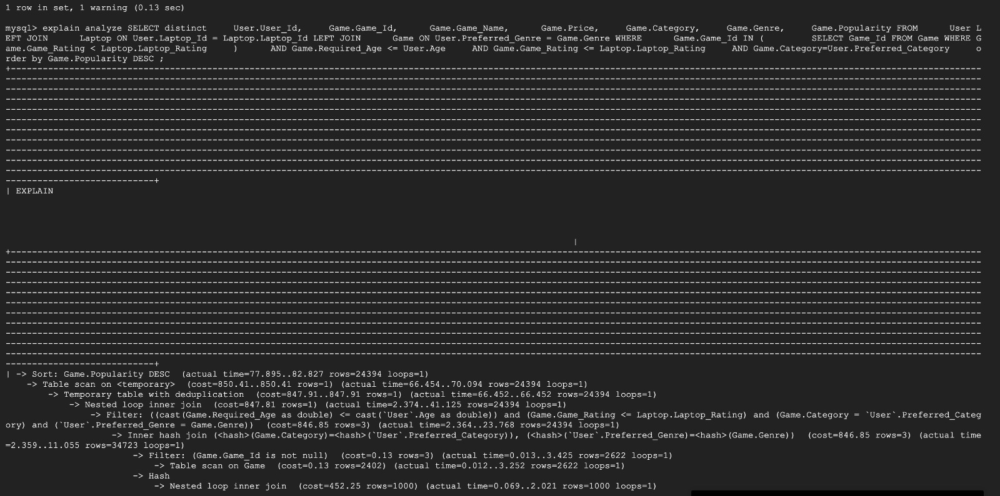
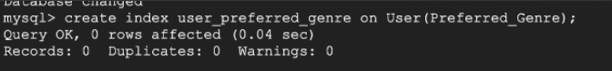
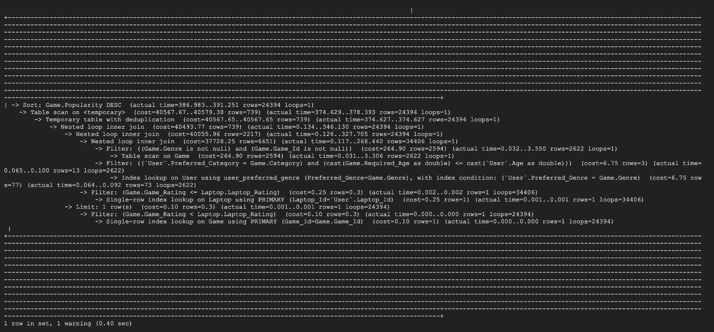
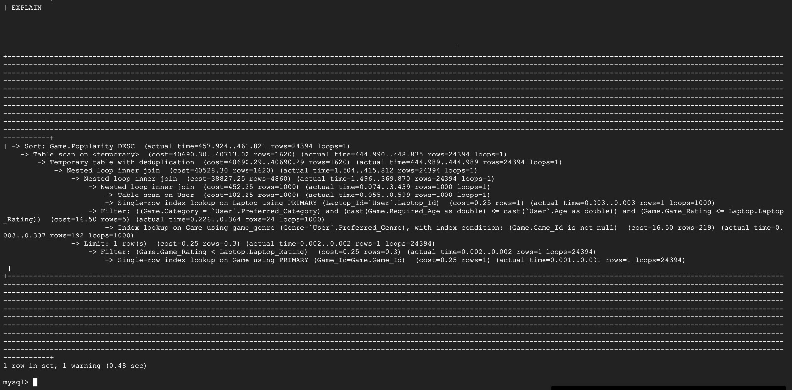
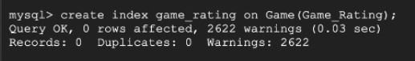
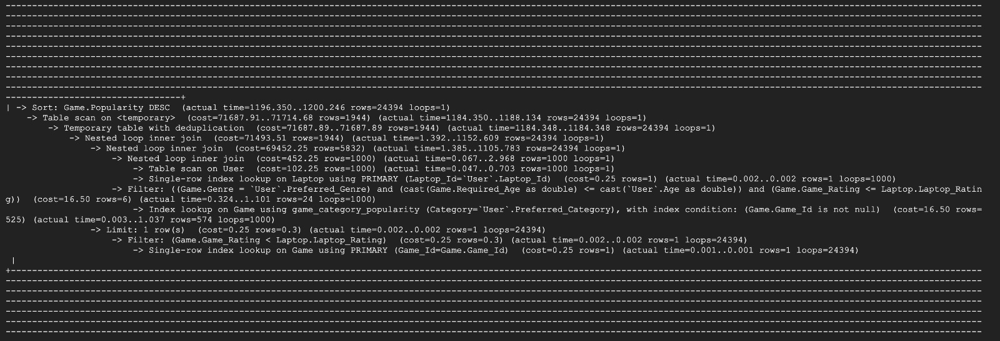

# Database Design

The stage 3 of our 411 Project revolves around initial implementation of the backend of our project. Given that our project is two fold ( has the two components of game recommendations and match scheduling), the team decided to focused on the game recommendation aspect of the project.

Below can be seen the development, as of today, on the project with the focus on the recommendation model of the system.

## Database Tables on GCP

The system is planned to be hosted on the Google Cloud Platform.
Based on the same, a connection was established and a project was ceated accordingly. For the project we decide to create a DB named `esports`.
Connection to GCP and the Esports DB are highlighted below:


As the focus was on game recommendation aspect of the project, the majority of the tables created were related to entities that would be involved in the same, these entities were the User, the User's Laptop and the Games.

Apart from this, we also started working on the match scheduling portion of the system by implementing the tables pertaining to user teams.

The list of implemented tables can be seen below:


As per stage submission requirements, the three tables with at least 1000 rows can be seen below:

The first table with over 1000 rows is Game table which is collected from the Steam dataset (proided by TA's)


The second table with over 1000 rows is Laptop table which is obtained using data from various datasets on Laptops.


The third table with over 1000 rows is the User table which consists of essential information like `User Preferred Category`,`User Preferred Genre`, `Laptop Id` for the user. This information plays a crucial role in providing accurate recommendations!


## DDL Commands

```sql
## Creating DB
CREATE DATABASE esports;

##Using Created DB
USE esports;

##Laptop Table
CREATE TABLE Laptop (
    Laptop_Id varchar(64) PRIMARY KEY,
    Brand Varchar(64) NOT NULL,
    Model Varchar(64) NOT NULL,
    Operating_System VARCHAR(64) NOT NULL,
    Processor_Speed INT NOT NULL,
    RAM INT NOT NULL,
    Graphics INT NOT NULL,
    Laptop_Rating Decimal(5,2) GENERATED ALWAYS AS 
        (
            (
                (Processor_Speed * 0.4) + (RAM * 0.3) + (Graphics * 0.3)
            ) 
            / 15.7 * 5 
        ) VIRTUAL
);

##User Table
CREATE TABLE User (
    User_Id varchar(16) PRIMARY KEY,
    First_Name VARCHAR(64) NOT NULL,
    Last_Name VARCHAR(64) NOT NULL,
    Pass_Word VARCHAR(64) NOT NULL,
    Date_of_Birth DATE,
    Age INT,
    Email VARCHAR(64) NOT NULL,
    Preferred_Genre VARCHAR(64),
    Preferred_Category VARCHAR(64),
    User_Type ENUM('Individual', 'Organizer') NOT NULL,
    Laptop_Id varchar(64),
    FOREIGN KEY (Laptop_Id) REFERENCES Laptop(Laptop_Id) ON DELETE SET NULL
);


##Trigger to calculate Age in User Table
DELIMITER //
CREATE TRIGGER calculate_age
BEFORE INSERT ON User
FOR EACH ROW
BEGIN
  IF NEW.Date_of_Birth IS NULL THEN
    SIGNAL SQLSTATE '45000' SET MESSAGE_TEXT = 'Date_of_Birth cannot be NULL';
  ELSE
    SET NEW.Age = FLOOR(DATEDIFF(CURDATE(), NEW.Date_of_Birth) / 365);
  END IF;
END;
//
DELIMITER ;

##Game Table
CREATE TABLE Game (
    Game_Id varchar(64) PRIMARY KEY,
    Game_Name text NOT NULL,
    Date_of_Release DATE,
    Price real NOT NULL,
    Genre VARCHAR(64), NOT NULL,
    Category VARCHAR(64), not null,
    Required_Age text not null,
    Popularity real not null,
    RAM INT not null,
    Processor_Speed INT not null,
    Graphics INT NOT NULL,
    Windows_Compatible INT not null,
    Linux_Compatible INT not null,
    Mac_Compatible INT not null,
    Game_Rating DECIMAL(5,2) GENERATED ALWAYS AS (
    (
        (Processor_Speed * 0.4) + (RAM * 0.3) + (Graphics * 0.3)
    ) 
    / 8.2 * 5
) VIRTUAL
);

## Team Table
CREATE TABLE Team (
    Team_Id varchar(64) PRIMARY KEY,
    Team_Name varchar(64) NOT NULL);

## Team to connect Users to Team
CREATE TABLE Team_to_User (
    Team_Id varchar(64) ,
    User_Id varchar(16) ,
    FOREIGN KEY (Team_Id) REFERENCES Team(Team_Id) ON DELETE SET NULL,
    FOREIGN KEY (User_Id) REFERENCES User(User_Id) ON DELETE SET NULL);


```

We do feel the need to provided explaination for some of the attributes defined; mainly the Laptop and Game Ratings.

It can be seen that Laptop & Game Ratings are calculated in a similar manner. We have tried to utilize weighted averages assinged to the 3 more important aspects to run a game, that is, Processor Speed, RAM and GPU.

Using these ratings with a calculated normalization factor, we are able to standardise the Ratings both for Game as well as Laptop ( multiplication done by 5 to get a rating scale of 1-5).

The normalization factor is calculated using the maximum possible values of the above mentioned attributes using the weighted values. 


It can also be seen that we have implemented a trigger that calcualtes user Age based on User Input whenere a user will register their profile. The calculation is based on the Date of Birth provided by the user.


## Advanced Queries

As mentioned above, the focus was to handle the game recommendation part of our project for this stage, hence, the two advanced queries below deal with the same:

### Query 1

```sql
### First Advanced Query
SELECT distinct
    User.User_Id,
    Game.Game_Id, 
    Game.Game_Name, 
    Game.Price,
    Game.Category,
    Game.Genre,
    Game.Popularity
FROM 
    User
LEFT JOIN 
    Laptop ON User.Laptop_Id = Laptop.Laptop_Id
LEFT JOIN 
    Game ON User.Preferred_Genre = Game.Genre
WHERE 
    Game.Game_Id IN (
        SELECT Game_Id FROM Game WHERE Game.Game_Rating < Laptop.Laptop_Rating
    ) 
    AND Game.Required_Age <= User.Age
    AND Game.Game_Rating <= Laptop.Laptop_Rating
    AND Game.Category=User.Preferred_Category
    order by Game.Popularity DESC;
```

The above query is one of our key queries for game recommendations. The query joins the User and Laptop Table in order to get the Laptop Rating for each user, and then performs a join on the Game table based on the User Preferred Category (This field is just a user input on what category of games does the user like). Post this join, there is a comparison between the Game_Rating and the Laptop_Rating which helps us figue out what games can actually run on the User's Laptop. This is followed by a Age Check (in order to ensure that the user is old enough to be able to play that particular game), post which equality operator ensures that the games recommended are to the user preferances. 

As per submission requirements, the output for the query, limited to 15 rows can be seen below:


### Query 2

```sql
SELECT distinct
    G1.Category, 
    G1.Game_Name, 
    G1.Popularity
FROM 
    Game G1
INNER JOIN (
    SELECT 
        Category, 
        AVG(Popularity) AS Avg_Popularity
    FROM 
        Game
    GROUP BY 
        Category
) AS G2
ON 
    G1.Category = G2.Category
WHERE 
    G1.Popularity > G2.Avg_Popularity
ORDER BY 
    G1.Category DESC, G1.Popularity DESC;
```

While Query 1 focuses on specific user recommendations, Query 2 is more generic. This query helps us to get the games that have a popularity above the average for their respective categories, hence making them in-demand games in that particular categories.
This query would be used to display game recommendations based on categories which would basically be used potentially on the home page or when a user is casually scrolling thorugh the website. 

As per submission requirements, the output for the query, limited to 15 rows can be seen below:


## Index Analysis

### Query 1

Default Index:


To summarize the reults from the picture above:

The query is fairly complex, involving multiple joins and a subquery. The overall query took around 82.827 ms to complete, with sorting by Game.Popularity taking the most time (77.895–82.827 ms). The use of nested loop inner join and hash join shows the query planner's attempt to optimize table scans. The filter conditions also contribute to execution time, taking up to 23.768 ms in one instance. Despite the temporary table with deduplication and the subsequent sorting operation, the performance could potentially be improved by indexing critical columns and re-evaluating join conditions.


#### First Index
We added an index on User.Preferred_Genre by using:



We decided to use this column as an index due to the reson that this column is used in the join condition between the User and Game tables, specifically `User.Preferred_Genre = Game.Genre`. Indexing this column can make the join operation faster by allowing the database engine to quickly locate the rows that satisfy this condition. 

The results achieved by using this index can be seen below:



The findings for this index were quite interesting. The index on `User.Preferred_Genre`  the query's execution time rather than decreasing it. Specifically, the overall actual time has risen to around 391.251 ms, a significant increase from the previous 82.827 ms. The nested loop inner join's actual time increased to 346.130 ms, up from 41.125 ms, with a much higher estimated cost of 40493.77. 

However, the index lookup on `User` using `user_preferred_genre` improved index scan efficiency, reducing the actual time to 0.064-0.092 ms per loop, but this was not enough to offset the increased costs elsewhere.
Interestingly, the temporary table with deduplication still took around 374.627 ms. This suggests that while the index might have optimized a small part of the query, it ended up increasing the overall cost and time.

#### Second Index

We added an index on Game.Genre by using:


We decided to use this column as an index due to its presence in the main join, as was for the above First index as well. Indexing this column can make the join operation faster by allowing the database engine to quickly locate the rows that satisfy this condition.

The results achieved by using this index can be seen below:



The index on Game.Genre  negatively impacted the query's performance compared to the original plan using primary indexing. The actual time required for the sort operation has increased to 461.821 ms from the initial 82.827 ms. Moreover, the nested loop inner join's actual time rose to 415.812 ms, up from 41.125 ms in the primary indexing scenario, with a higher estimated cost of 40528.30.
That said, the index lookup on Game using game_genre streamlined the process of finding relevant rows in the Game table, reducing the actual time per loop to a range of 0.003-0.337 ms. However, this improvement is insufficient to counterbalance the performance loss in other parts of the query

#### Third Index
We added an index on Game.Genre by using:



We decided to use this column as an index due to the reson that this column is involved in multiple places in the query, most notably in the subquery condition `WHERE Game.Game_Rating < Laptop.Laptop_Rating` and the main query filter `AND Game.Game_Rating <= Laptop.Laptop_Rating`. Indexing this column can optimize these filtering steps, potentially reducing both the time and the cost associated with the query

The results achieved by using this index can be seen below:



It can be seen that the Game.Game_Rating has had a negative impact on the query's performance. The actual time required for sorting has increased  to 1200.246 ms from the initial 82.827 ms with primary indexing. The actual time required for the nested loop inner join has also soared to 1152.609 ms, up from 41.125 ms.

The cost associated with the table scan on the temporary table is particularly high, at 71687.91, which reflects in the actual time of 1184.350 ms. This is a considerable increase when compared to both primary indexing and other secondary indexings, suggesting that this index is not effective for the current query.

Interestingly, the filtering conditions have also become more time-consuming; specifically, the filter taking 0.324-1.101 ms for each of the 1000 loops through the Game table. This is noticeably more than with primary indexing or the other secondary indexings.

So, based on these indexes implemented for the Advanced Query 1, we can understand that there is still some options that we can explore, given that single key indexing is not the solution, next attempts would be to try composite keys in combinations, as having two or more keys in the index should in theory ( for this particular scenario) be able to improve the performance.

### Query 2

Default Index:


```sql

```
